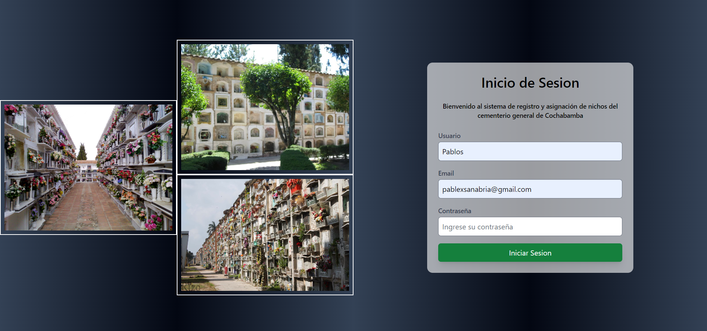
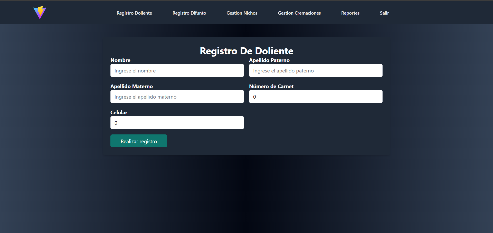
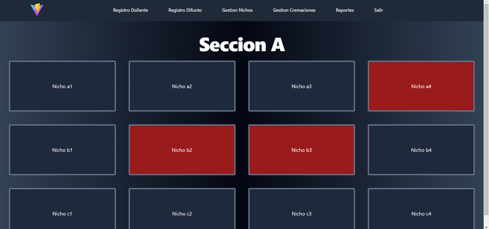
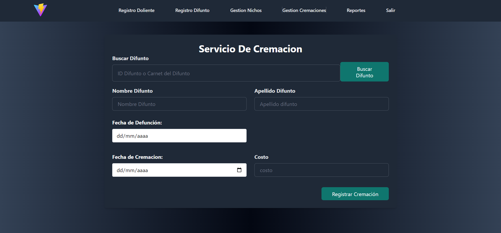
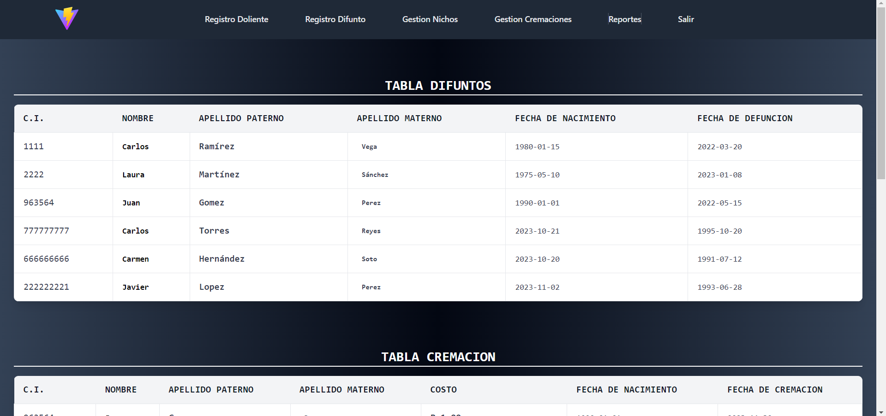

# Sistema - Web - Cementerio

## Descripción
Sistema web para gestionar un cementerio, abarcando desde el registro de difuntos y sus encargados hasta la asignación del sector y área del nicho a escoger.

Se utilizo ReactJS para el desarrollo de las interfaces y Python para la logica del servidor, con sus librerias Flask y psycopg2 para la conexion de base de datos.

## Características
- Pagina para la gestion de un cementerio.
- API desarrollada en Flask.
- Inicio de sesion, registro, actualizacion y reportes.

## Instrucciones de Uso
### Frontend (React)

1. Abra la terminal y navegue a la carpeta del Frontend: `cd frontend`.
2. Instale las dependencias utilizando el comando: `npm install`.

### Backend (Flask)

1. Abra otra terminal y navegue a la carpeta del Backend: `cd backend`.
2. Instale las librerías necesarias ejecutando: `pip install -r requirements.txt`.

### Ejecución

1. En la terminal del Frontend, ejecute el proyecto React con el comando: `npm run dev`.
2. En la terminal del Backend, inicie el servidor Flask con: `python app.py`.

## Dependencias
Las dependecias estan en el mismo repositorio.

## Imagenes

    
    

    
    

## Licencia
Este proyecto está bajo la Licencia MIT. Consulta el archivo [LICENSE](LICENSE) para obtener más detalles.

---

